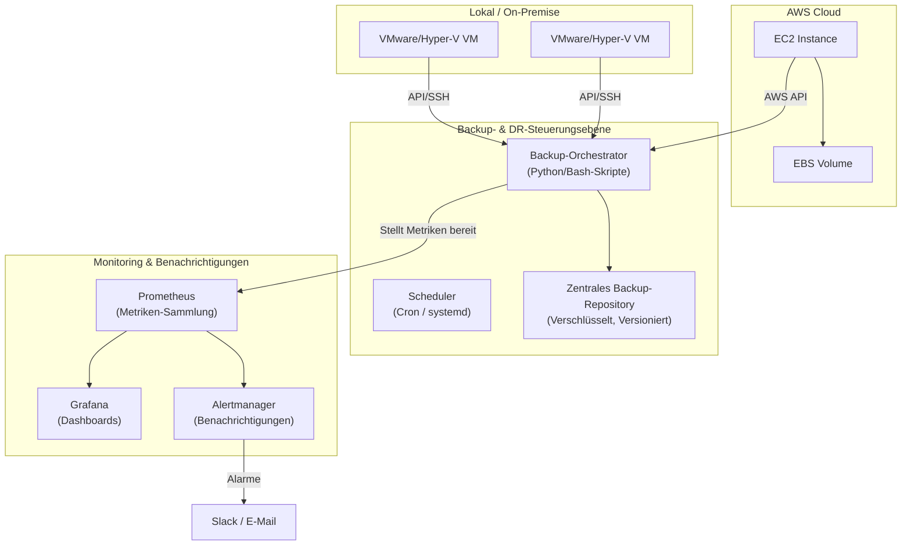

# 🛡️ Sicherstellung der Geschäftskontinuität: Eine zentralisierte Backup- & Disaster-Recovery-Strategie

[](https://opensource.org/licenses/MIT)

Eine widerstandsfähige, skalierbare und automatisierte Lösung zum Schutz von lokalen VMs und kritischen AWS-Ressourcen, die minimale Ausfallzeiten und keinen Datenverlust gewährleistet.

Dieses Repository enthält die vollständige Architektur, Implementierungsskripte und Betriebsabläufe für eine zentralisierte Backup- und Disaster-Recovery- (DR) Strategie. Sie wurde entwickelt, um hohe Verfügbarkeit und Datenintegrität in einer hybriden Cloud-Umgebung zu gewährleisten.

---

## 🎯 Projektziel

Architektur und Implementierung eines einheitlichen Disaster-Recovery-Frameworks, das **Recovery Time Objective (RTO)** und **Recovery Point Objective (RPO)** minimiert. Dies wird durch robuste Automatisierung, umfassendes Monitoring und klar dokumentierte Verfahren erreicht, um Infrastrukturausfällen, menschlichem Versagen oder Cyber-Bedrohungen entgegenzuwirken.

---

## Inhaltsverzeichnis

1.  [Wichtige Merkmale](#-wichtige-merkmale)
2.  [Leitprinzipien](#-leitprinzipien)
3.  [Systemarchitektur](#-systemarchitektur)
4.  [Technologie-Stack](#-technologie-stack)
5.  [Erste Schritte](#-erste-schritte)
    -   [Voraussetzungen](#voraussetzungen)
    -   [Installation & Konfiguration](#installation--konfiguration)
6.  [Verwendung](#-verwendung)
    -   [Manuelles Backup durchführen](#manuelles-backup-durchführen)
    -   [Wiederherstellung durchführen](#wiederherstellung-durchführen)
7.  [Monitoring & Benachrichtigungen](#-monitoring--benachrichtigungen)
8.  [Disaster-Recovery-Prozesse (RTO/RPO)](#-disaster-recovery-prozesse-rtorpo)
9.  [Testen & Validierung](#-testen--validierung)
10. [Repository-Struktur](#-repository-struktur)
11. [Mitwirken](#-mitwirken)
12. [Lizenz](#-lizenz)

---

## ✨ Wichtige Merkmale

*   **Unterstützung für hybride Umgebungen**: Verwaltet Backups sowohl für lokale virtuelle Maschinen (z.B. VMware, Hyper-V) als auch für AWS-Cloud-Ressourcen (EBS Snapshots).
*   **Automatisierter Backup-Lebenszyklus**: Robuste Skripte (Python/Bash) zur Planung, Ausführung und Überprüfung von Backups mit konfigurierbaren Aufbewahrungsrichtlinien.
*   **Zentralisierte Verwaltung**: Eine einzige Steuerungsebene zur Initiierung und Überwachung aller Backup- und Wiederherstellungsvorgänge.
*   **Kontinuierliche Systemüberwachung**: Echtzeit-Einblick in den Status von Backup-Jobs, die Systemgesundheit und die Speichernutzung mit Prometheus.
*   **Intelligente Benachrichtigungen**: Proaktive Benachrichtigungen bei Backup-Fehlern, RPO-Verletzungen oder Systemanomalien über Alertmanager (an Slack, E-Mail usw.).
*   **Umfassende Visualisierung**: Interaktive Grafana-Dashboards bieten einen klaren Überblick über Backup-Verlauf, Dauer, Datenvolumen und DR-Bereitschaft.
*   **Dokumentierte DR-Playbooks**: Schritt-für-Schritt-Anleitungen (Runbooks) für verschiedene Ausfallszenarien, die eine planbare und schnelle Wiederherstellung gewährleisten.
*   **Unveränderlich & Sicher**: Implementiert Best Practices wie verschlüsselte Backups und kann mit unveränderlichen Speicherzielen (wie S3 Object Lock) integriert werden, um vor Ransomware zu schützen.

---

## 🧭 Leitprinzipien

Diese Lösung wurde unter Berücksichtigung der folgenden Best Practices aus Site Reliability Engineering (SRE) und DevOps entwickelt:

*   🔐 **Sicherheit an erster Stelle**: Verwendung von IAM-Rollen mit minimalen Rechten, verschlüsselte Datenübertragung und -speicherung (at-rest) sowie sichere Verwaltung von Anmeldeinformationen.
*   ⚙️ **Automatisierung statt manueller Arbeit**: Wenn eine Aufgabe wiederholbar ist, wird sie skriptgesteuert. Dies reduziert menschliche Fehler und gewährleistet Konsistenz.
*   📈 **Auf Skalierbarkeit ausgelegt**: Die Architektur kann von einer Handvoll VMs auf Hunderte von Assets wachsen, ohne dass ein größeres Redesign erforderlich ist.
*   ✅ **Testbarkeit ist entscheidend**: Das System ist darauf ausgelegt, regelmäßig getestet zu werden. Ein DR-Plan, der nicht getestet wird, ist kein Plan – er ist eine Theorie.
*   📊 **Beobachtbarkeit ist kein nachträglicher Gedanke**: Tiefgreifendes Monitoring und Benachrichtigungen sind in den Kern der Lösung integriert.

---

## 🏗️ Systemarchitektur

Die Architektur ist auf Widerstandsfähigkeit und Übersichtlichkeit ausgelegt. Ein zentraler Backup-Orchestrator steuert den gesamten Prozess, sammelt Daten von lokalen und Cloud-Quellen, speichert sie sicher und stellt Metriken für das Monitoring bereit.



---

## 🛠️ Technologie-Stack

*   **Automatisierung & Skripting**: Python (Boto3), Bash
*   **Cloud-Anbieter**: AWS (EC2, EBS, S3, IAM)
*   **Lokale Virtualisierung**: `[TODO: vSphere, Hyper-V oder andere angeben]`
*   **Monitoring**: Prometheus
*   **Visualisierung & Benachrichtigungen**: Grafana, Alertmanager
*   **Infrastructure as Code (Optional)**: `[TODO: Angeben, ob Terraform/Ansible verwendet wurde]`
*   **Benachrichtigungen**: Slack, PagerDuty, E-Mail

---

## 🚀 Erste Schritte

Folgen Sie diesen Anweisungen, um die Backup- und Wiederherstellungsumgebung einzurichten.

### Voraussetzungen

*   `[TODO: Alle benötigten Werkzeuge und Zugriffsebenen auflisten. Seien Sie spezifisch bei den Versionen.]`
*   **Beispiel:**
    *   Python 3.8+ mit `boto3` und `requests`
    *   AWS CLI v2, konfiguriert mit einem IAM-Benutzer/einer IAM-Rolle mit entsprechenden Berechtigungen.
    *   SSH-Schlüsselbasierter Zugriff auf den lokalen Hypervisor oder Verwaltungsserver.
    *   Docker & Docker Compose (zum Ausführen des Monitoring-Stacks).
    *   `rsync` und `jq` installiert.

### Installation & Konfiguration

1.  **Klonen Sie das Repository:**
    ```sh
    git clone https://github.com/[your-username]/[your-repository-name].git
    cd [your-repository-name]
    ```

2.  **Abhängigkeiten installieren:**
    `[TODO: Befehl zur Installation von Python-/anderen Abhängigkeiten angeben]`
    ```sh
    pip install -r requirements.txt
    ```

3.  **Konfigurieren Sie die Umgebung:**
    `[TODO: Erklären, wie die Skripte konfiguriert werden. Dies ist ein entscheidender Schritt.]`
    *   Benennen Sie `config.env.example` in `config.env` um.
    *   Aktualisieren Sie `.env` mit Ihren AWS-Anmeldeinformationen, lokalen Endpunkten und S3-Bucket-Namen.
    *   Definieren Sie Ihre Backup-Ziele in `targets.yml`.

4.  **Starten Sie den Monitoring-Stack:**
    ```sh
    docker-compose up -d
    ```
    Dies startet die Prometheus- und Grafana-Container.
    *   **Prometheus:** `http://<your-server-ip>:9090`
    *   **Grafana:** `http://<your-server-ip>:3000` (Standardbenutzer/-passwort: admin/admin)

---

## ⚙️ Verwendung

### Manuelles Backup durchführen

Um ein On-Demand-Backup für ein bestimmtes Ziel auszulösen:
`[TODO: Den genauen Befehl und ein Beispiel angeben]`
```sh
python run_backup.py --target <target_name_from_targets.yml>
```

### Wiederherstellung durchführen

Der Wiederherstellungsprozess ist detailliert in den Runbooks dokumentiert. Im Überblick:
`[TODO: Die groben Schritte und einen Beispielbefehl angeben]`
1.  Identifizieren Sie die benötigte Backup-/Snapshot-ID aus den Protokollen oder dem Grafana-Dashboard.
2.  Führen Sie das Wiederherstellungsskript mit der identifizierten ID und dem Ziel aus:
    ```sh
    python run_restore.py --snapshot-id <aws-snapshot-id> --destination-instance <aws-instance-id>
    ```

---

## 📊 Monitoring & Benachrichtigungen

*   **Grafana Dashboards**: Vorgefertigte Dashboards im Verzeichnis `/dashboards` können in Grafana importiert werden, um Folgendes zu visualisieren:
    *   Status der Backup-Jobs (Erfolgreich, Fehlgeschlagen, In Bearbeitung)
    *   RPO-Konformitäts-Tracker
    *   Trends bei Backup-Dauer & Datenvolumen
    *   Speicherkapazität
    `[TODO: Fügen Sie hier einen Screenshot Ihres Haupt-Grafana-Dashboards ein. Das ist sehr wirkungsvoll!]`

*   **Prometheus-Alarme**: Alarmierungsregeln sind in `prometheus/alert.rules.yml` definiert. Wichtige Alarme sind:
    *   `BackupJobFailed`: Wird ausgelöst, wenn ein Backup-Job fehlschlägt.
    *   `RPOViolated`: Wird ausgelöst, wenn die Zeit seit dem letzten erfolgreichen Backup das definierte RPO überschreitet.
    *   `BackupStorageCapacityHigh`: Wird ausgelöst, wenn die Speichernutzung des Backup-Repositorys > 85% beträgt.

---

## ⏱️ Disaster-Recovery-Prozesse (RTO/RPO)

Unsere Wiederherstellungsziele sind gestaffelt, um der Geschäftskritikalität gerecht zu werden.

| Stufe | RTO (Wiederherstellungszeitziel) | RPO (Wiederherstellungspunktziel) | Beispiel-Workloads                        |
| :--- | :---------------------------- | :----------------------------- | :--------------------------------------- |
| **1**| `[TODO: z.B., < 1 Stunde]`      | `[TODO: z.B., < 15 Minuten]`   | `[TODO: z.B., Kritische Datenbanken, Auth-Dienste]` |
| **2**| `[TODO: z.B., < 4 Stunden]`     | `[TODO: z.B., < 12 Stunden]`     | `[TODO: z.B., Interne Apps, Webserver]` |
| **3**| `[TODO: z.B., < 24 Stunden]`    | `[TODO: z.B., < 24 Stunden]`     | `[TODO: z.B., Dev/Test-Umgebungen, Archive]`  |

Detaillierte Schritt-für-Schritt-DR-Pläne für verschiedene Szenarien befinden sich im Verzeichnis `/runbooks`.
*   `[DR-Plan: Ausfall eines lokalen Hosts](./runbooks/on_prem_host_failure.md)`
*   `[DR-Plan: Nichtverfügbarkeit einer AWS-Region](./runbooks/aws_region_failure.md)`
*   `[DR-Plan: Ransomware-Angriff / Datenbeschädigung](./runbooks/data_corruption_recovery.md)`

---

## 🧪 Testen & Validierung

Ein Disaster-Recovery-Plan ist nur dann zuverlässig, wenn er regelmäßig getestet wird. Unsere Validierungsstrategie umfasst:

*   **Automatisierte Wiederherstellungstests**: Wöchentliche, automatisierte Jobs, die eine unkritische VM oder einen Snapshot an einem temporären Ort wiederherstellen und einen grundlegenden Systemcheck durchführen.
*   **Vierteljährliche DR-Übungen**: Simulierte, umfassende Ausfallübungen, um die Verfahren, Werkzeuge und die Reaktion des Teams zu testen.
*   **Leistungsverfolgung**: Wir messen die **tatsächliche Wiederherstellungszeit (Actual Recovery Time, ART)** während der Tests und verwenden sie zur Verfeinerung unserer RTOs und Verfahren.

---

## 📂 Repository-Struktur

```
.
├── configs/               # Umgebungsvariablen, Ziellisten (targets.yml)
├── dashboards/            # Grafana JSON-Dashboard-Modelle
├── docs/                  # Erweiterte Dokumentation (Architekturdetails, etc.)
├── monitoring/            # Prometheus-Regeln, Docker-Compose für den Monitoring-Stack
├── runbooks/              # Schritt-für-Schritt-Wiederherstellungsanleitungen für DR-Szenarien
├── scripts/               # Kernskripte für Backup, Wiederherstellung und Hilfsprogramme
├── tests/                 # Skripte zum Testen der Backup-Integrität und Wiederherstellungen
├── .gitignore
├── LICENSE
└── README.md
```

---

## 🤝 Mitwirken

Beiträge machen die Open-Source-Community zu einem großartigen Ort, um zu lernen und zu erschaffen. Jeder Beitrag, den Sie leisten, wird **sehr geschätzt**. Bitte forken Sie das Repo und erstellen Sie einen Pull-Request. Sie können auch einfach ein Issue mit dem Tag "enhancement" öffnen.

---

## 📄 Lizenz

Verteilt unter der MIT-Lizenz. Siehe `LICENSE` für weitere Informationen.
