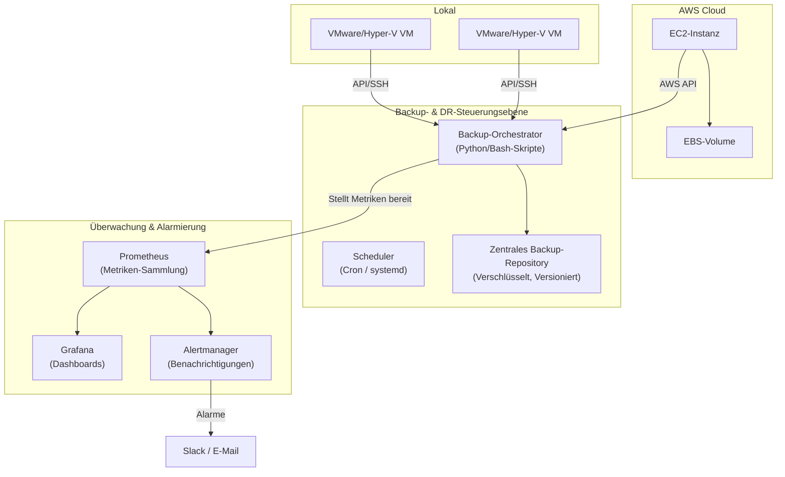

# 🛡️ Sicherung der Geschäftskontinuität: Eine zentralisierte Backup- & Disaster-Recovery-Strategie

[](https://opensource.org/licenses/MIT)

Eine widerstandsfähige, skalierbare und automatisierte Lösung zum Schutz von lokalen VMs und kritischen AWS-Ressourcen, die minimale Ausfallzeiten und keinen Datenverlust gewährleistet.

Dieses Repository enthält die vollständige Architektur, Implementierungsskripte und Betriebsabläufe für eine zentralisierte Backup- und Disaster-Recovery-(DR)-Strategie. Sie wurde entwickelt, um Hochverfügbarkeit und Datenintegrität in einer hybriden Cloud-Umgebung zu gewährleisten.

---

## 🎯 Projektziel

Die Entwicklung und Implementierung eines einheitlichen Disaster-Recovery-Frameworks, das die **Wiederherstellungszeitziele (RTO)** und **Wiederherstellungspunktziele (RPO)** minimiert. Dies wird durch robuste Automatisierung, umfassende Überwachung und klar dokumentierte Verfahren erreicht, um Infrastrukturausfällen, menschlichem Versagen oder Cyber-Bedrohungen entgegenzuwirken.

---

## Inhaltsverzeichnis

1.  [Wichtige Merkmale](#-wichtige-merkmale)
2.  [Leitprinzipien](#-leitprinzipien)
3.  [Systemarchitektur](#-systemarchitektur)
4.  [Technologie-Stack](#-technologie-stack)
5.  [Erste Schritte](#-erste-schritte)
    -   [Voraussetzungen](#voraussetzungen)
    -   [Installation & Konfiguration](#installation--konfiguration)
6.  [Nutzung](#-nutzung)
    -   [Manuelles Backup ausführen](#manuelles-backup-ausführen)
    -   [Wiederherstellung durchführen](#wiederherstellung-durchführen)
7.  [Überwachung & Alarmierung](#-überwachung--alarmierung)
8.  [Disaster-Recovery-Verfahren (RTO/RPO)](#-disaster-recovery-verfahren-rtorpo)
9.  [Testen & Validierung](#-testen--validierung)
10. [Repository-Struktur](#-repository-struktur)
11. [Mitwirken](#-mitwirken)
12. [Lizenz](#-lizenz)

---

## ✨ Wichtige Merkmale

*   **Unterstützung für hybride Umgebungen**: Verwaltet Backups für lokale virtuelle Maschinen (z.B. VMware, Hyper-V) und AWS-Cloud-Ressourcen (EBS Snapshots).
*   **Automatisierter Backup-Lebenszyklus**: Robuste Skripte (Python/Bash) zur Planung, Ausführung und Überprüfung von Backups mit konfigurierbaren Aufbewahrungsrichtlinien.
*   **Zentralisierte Verwaltung**: Eine einzige Steuerungsebene zur Initiierung und Überwachung aller Backup- und Wiederherstellungsvorgänge.
*   **Kontinuierliche Zustandsüberwachung**: Echtzeit-Einblick in den Status von Backup-Jobs, Systemzustand und Speichernutzung mit Prometheus.
*   **Intelligente Alarmierung**: Proaktive Benachrichtigungen bei Backup-Fehlern, RPO-Verletzungen oder Systemanomalien über Alertmanager (an Slack, E-Mail, etc.).
*   **Umfangreiche Visualisierung**: Interaktive Grafana-Dashboards bieten einen klaren Überblick über Backup-Verlauf, Dauer, Datenmenge und DR-Bereitschaft.
*   **Dokumentierte DR-Playbooks**: Schritt-für-Schritt-Anleitungen (Runbooks) für verschiedene Ausfallszenarien, um eine vorhersagbare und schnelle Wiederherstellung zu gewährleisten.
*   **Unveränderlich & Sicher**: Implementiert bewährte Praktiken wie verschlüsselte Backups und kann mit unveränderlichen Speicherzielen (wie S3 Object Lock) integriert werden, um vor Ransomware zu schützen.

---

## 🧭 Leitprinzipien

Diese Lösung wurde unter Berücksichtigung der folgenden bewährten Praktiken aus Site Reliability Engineering (SRE) und DevOps entwickelt:

*   🔐 **Sicherheit an erster Stelle**: Verwendung von IAM-Rollen mit den geringsten Rechten, verschlüsselte Datenübertragung und Speicherung im Ruhezustand sowie sichere Verwaltung von Anmeldeinformationen.
*   ⚙️ **Automatisierung statt manueller Arbeit**: Wenn eine Aufgabe wiederholbar ist, wird sie skriptgesteuert. Dies reduziert menschliche Fehler und gewährleistet Konsistenz.
*   📈 **Für Skalierbarkeit konzipiert**: Die Architektur kann von einer Handvoll VMs auf Hunderte von Assets anwachsen, ohne dass ein größeres Redesign erforderlich ist.
*   ✅ **Testbarkeit ist entscheidend**: Das System ist so aufgebaut, dass es regelmäßig getestet werden kann. Ein DR-Plan, der nicht getestet wird, ist kein Plan – es ist eine Theorie.
*   📊 **Beobachtbarkeit ist kein nachträglicher Gedanke**: Tiefgreifende Überwachung und Alarmierung sind in den Kern der Lösung integriert.

---

## 🏗️ Systemarchitektur

Die Architektur ist auf Widerstandsfähigkeit und Klarheit ausgelegt. Ein zentraler Backup-Orchestrator verwaltet den gesamten Prozess, sammelt Daten aus lokalen und Cloud-Quellen, speichert sie sicher und stellt Metriken für die Überwachung bereit.



---

## 🛠️ Technologie-Stack

*   **Automatisierung & Skripting**: Python (Boto3), Bash
*   **Cloud-Anbieter**: AWS (EC2, EBS, S3, IAM)
*   **Lokale Virtualisierung**: Hyper-V
*   **Überwachung**: Prometheus
*   **Visualisierung & Alarmierung**: Grafana, Alertmanager
*   **Infrastructure as Code (Optional)**: Terraform
*   **Benachrichtigungen**: Slack, PagerDuty, E-Mail

---

## 🚀 Erste Schritte

Folgen Sie diesen Anweisungen, um die Backup- und Wiederherstellungsumgebung einzurichten.

### Voraussetzungen

*   Python 3.8+ mit `boto3`, `pyyaml` und `requests`
*   AWS CLI v2, konfiguriert mit einer IAM-Rolle/einem Benutzer mit folgenden Berechtigungen:
    *   `AmazonEC2FullAccess` (oder mit minimalen Rechten: `CreateSnapshot`, `Describe*`, `Start/StopInstances`, etc.)
    *   `AmazonS3ReadOnlyAccess` (für Audits) und Schreibzugriff auf Ihren Backup-Bucket
    *   `CloudWatchReadOnlyAccess` (optional für Metriken)
*   SSH-schlüsselbasierter Zugriff auf den lokalen Hypervisor-Verwaltungsserver mit `virsh`- oder `PowerShell`-Zugriff
*   Docker & Docker Compose v2+ (um Prometheus, Grafana, Alertmanager auszuführen)
*   `rsync`, `jq`, `curl` und `pigz` (für Komprimierung) auf dem Backup-Orchestrator-Host installiert
*   Ausgehender Internetzugang für AWS-API- und Abhängigkeits-Downloads

### Installation & Konfiguration

1.  **Klonen Sie das Repository:**
    ```sh
    git clone https://github.com/[your-username]/[your-repository-name].git
    cd [your-repository-name]
    ```

2.  **Installieren Sie die Abhängigkeiten:**
    ```sh
    pip install -r requirements.txt
    ```

3.  **Konfigurieren Sie die Umgebung:**

*   Benennen Sie `config.env.example` in `config.env` um.
*   Aktualisieren Sie `config.env` mit den folgenden Informationen:
    *   Ihre AWS-Anmeldeinformationen (`AWS_ACCESS_KEY_ID`, `AWS_SECRET_ACCESS_KEY`, `AWS_DEFAULT_REGION`)
    *   S3-Bucket-Name zum Speichern von Backup-Manifesten und Artefakten
    *   IP-Adresse des lokalen Hypervisors, SSH-Benutzer und VM-Liste/IDs
    *   Einstellungen für die Backup-Aufbewahrung (täglich/wöchentlich/monatlich)
*   Definieren Sie Ihre Backup-Ziele (VMs, EC2-Instanzen) in `configs/targets.yml` unter Verwendung des bereitgestellten Schemas.
*   Stellen Sie sicher, dass auf dem Orchestrator-Server SSH-Schlüssel für die lokalen Hosts bereitgestellt und die IAM-Rolle zugewiesen ist (falls auf EC2 ausgeführt).


4.  **Starten Sie den Überwachungs-Stack:**
    ```sh
    docker-compose up -d
    ```
    Dies startet die Prometheus- und Grafana-Container.
    *   **Prometheus:** `http://<your-server-ip>:9090`
    *   **Grafana:** `http://<your-server-ip>:3000` (Standardbenutzer/Passwort: admin/admin)

---

## ⚙️ Nutzung

### Manuelles Backup ausführen

Um ein On-Demand-Backup für ein bestimmtes Ziel auszulösen:
```sh
python scripts/run_backup.py --target webserver-prod
```

### Wiederherstellung durchführen

1.  Identifizieren Sie die benötigte Backup-Snapshot-ID über das Grafana-Dashboard, die Protokolle oder mit folgendem Befehl:
    ```sh
    aws ec2 describe-snapshots --filters "tag:BackupName=webserver-prod" --query 'Snapshots[*].[SnapshotId,StartTime,VolumeId]' --output table
    ```
2.  Führen Sie das Wiederherstellungsskript aus:
    ```sh
    python scripts/run_restore.py --snapshot-id snap-0f5d1a2b3c4d5e --destination-instance i-987zyx --region us-east-1
    ```
3.  Validieren Sie den Zustand des Dienstes nach der Wiederherstellung durch Überwachung oder Anwendungsprüfungen.
4.  Aktualisieren Sie DNS/Failover, wenn Sie auf einer neuen Instanz wiederherstellen (DR-Szenario).


---

## 📊 Überwachung & Alarmierung

*   **Grafana-Dashboards**: Vorgefertigte Dashboards im Verzeichnis `/dashboards` können in Grafana importiert werden, um Folgendes zu visualisieren:
    *   Status der Backup-Jobs (Erfolgreich, Fehlgeschlagen, In Bearbeitung)
    *   RPO-Konformitäts-Tracker
    *   Trends bei Backup-Dauer & Datengröße
    *   Speicherkapazität

*   **Prometheus-Alarme**: Alarmierungsregeln sind in `prometheus/alert.rules.yml` definiert. Wichtige Alarme sind:
    *   `BackupJobFailed`: Wird ausgelöst, wenn ein Backup-Job fehlschlägt.
    *   `RPOViolated`: Wird ausgelöst, wenn die Zeit seit dem letzten erfolgreichen Backup das definierte RPO überschreitet.
    *   `BackupStorageCapacityHigh`: Wird ausgelöst, wenn die Festplattennutzung des Backup-Repositorys > 85 % beträgt.

---

## ⏱️ Disaster-Recovery-Verfahren (RTO/RPO)

Unsere Wiederherstellungsziele sind gestaffelt, um der Geschäftskritikalität gerecht zu werden.

| Stufe | RTO (Wiederherstellungszeitziel) | RPO (Wiederherstellungspunktziel) | Beispiel-Workloads                        |
| :--- | :---------------------------- | :----------------------------- | :--------------------------------------- |
| **1**| **< 1 Stunde**                | **< 15 Minuten**               | **Kritische Datenbanken, Identitätsdienste, Zahlungs-Gateways** |
| **2**| **< 4 Stunden**               | **< 12 Stunden**                 | **Interne Anwendungen, Webserver, APIs** |
| **3**| **< 24 Stunden**              | **< 24 Stunden**                 | **Entwicklungs-/Testumgebungen, Archive, Protokolle** |

Detaillierte Schritt-für-Schritt-DR-Pläne für verschiedene Szenarien befinden sich im Verzeichnis `/runbooks`.
*   `[DR-Plan: Ausfall eines lokalen Hosts](./runbooks/on_prem_host_failure.md)`
*   `[DR-Plan: Nichtverfügbarkeit einer AWS-Region](./runbooks/aws_region_failure.md)`
*   `[DR-Plan: Ransomware-Angriff / Datenbeschädigung](./runbooks/data_corruption_recovery.md)`

---

## 🧪 Testen & Validierung

Ein Disaster-Recovery-Plan ist nur dann zuverlässig, wenn er regelmäßig getestet wird. Unsere Validierungsstrategie umfasst:

*   **Automatisierte Wiederherstellungstests**: Wöchentliche, automatisierte Jobs, die eine unkritische VM oder einen Snapshot an einem temporären Ort wiederherstellen und einen grundlegenden Gesundheitscheck durchführen.
*   **Vierteljährliche DR-Übungen**: Simulierte, umfassende Ausfallübungen, um die Verfahren, Werkzeuge und die Reaktion des Teams zu testen.
*   **Leistungsverfolgung**: Wir messen die **tatsächliche Wiederherstellungszeit (Actual Recovery Time, ART)** während der Tests und verwenden sie zur Verfeinerung unserer RTOs und Verfahren.

---

## 📂 Repository-Struktur

```
.
├── configs/               # Umgebungsvariablen, Ziellisten (targets.yml)
├── dashboards/            # Grafana-JSON-Dashboard-Modelle
├── docs/                  # Erweiterte Dokumentation (Architekturdetails, etc.)
├── monitoring/            # Prometheus-Regeln, Docker-Compose für den Überwachungs-Stack
├── runbooks/              # Schritt-für-Schritt-Wiederherstellungsanleitungen für DR-Szenarien
├── scripts/               # Kernskripte für Backup, Wiederherstellung und Hilfsprogramme
├── tests/                 # Skripte zum Testen der Backup-Integrität und Wiederherstellungen
├── .gitignore
├── LICENSE
└── README.md
```

---

## 🤝 Mitwirken

Beiträge machen die Open-Source-Community zu einem großartigen Ort zum Lernen und Gestalten. Jeder Beitrag, den Sie leisten, wird **sehr geschätzt**. Bitte forken Sie das Repo und erstellen Sie einen Pull Request. Sie können auch einfach ein Issue mit dem Tag "enhancement" eröffnen.

---

## 📄 Lizenz

Verteilt unter der MIT-Lizenz. Siehe `LICENSE` für weitere Informationen.
